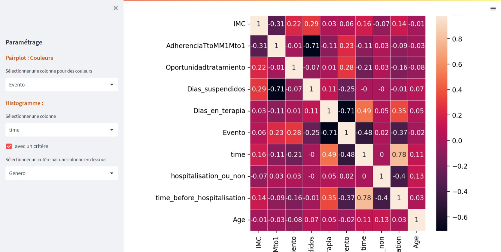

# appAnalyseSurvie
L'application d'analayse de survie est réalisée pendant l'unité d'enseignement de projet d'ingénierie des données (PID) à Polytech Lyon, France. L'application fournit plusieurs fonctionalités pour l'analyse de survie basée sur **Python v. 3.9.16, streamlit v. 1.21.0**.

## Bibliothèques d'outil
On emploit des bibliothèques suivantes pour la réalisation de l'application :
- streamlit v. 1.21.0 pour faire facilement l'application web 
- streamlit_option_menu v. 0.3.2 , l'interface graphique de menu pour streamlit
- pandas v. 1.5.3, pour la manipulation de dataframe et serie de données
- numpy v. 1.23.5, pour la manipulation de tableaux de données
- matplotlib.pyplot v. 3.7.1 pour afficher des graphiques de données
- lifelines v. 0.27.4 pour l’analyse de survie 
- seaborn v. 0.12.2 pour afficher des jolis graphiques de données

## Fonctionlités
### 1. Lecture des données
  Lire un fichier de CSV en saissisant un délimiter et sélectionnant l'un dans la liste de codec par un utilisateur. L'application aussi affiche 5 première lignes d'un dataframe. 
### 2. Traitement des données manquantes
  - Afficher le dataframe et un récapitulatif des noms de colonne, leur type de données et le nombre de données manquantes dans chaque colonne. 
  - Transformer un type de donnée dans la colonne sélectionnée en l'un de la liste de types : **object, numérique, category, datetime, bool**. 
  - Remplacer les données manquantes selon le cas suivant :
     - Si c'est une colonne de type numérique, on peut les ramplacer par soit le mean soit le median soit le mode de la colonne.
     - Si c'est une colonne de type non numérique, on peut les remplacer par la sélection d'une valeur de string dans la liste proposée aussi bien que l'application          affcihe le mode qui est la valeur qui apparaît le plus souvent pour le conseil (il peut y avoir plusieurs modes). De plus, on peut saisir un mot de notre choix        en sélectionnat "Autre" dans la liste au-dessus.
  - Supprimer les lignes de données manquantes en critère choisi soit **any** soit **all** :
     - any : Si des valeurs NA sont présentes, supprimez cette ligne. 
     - all : Si toutes les valeurs sont NA, supprimez cette ligne.  
  - Pareillement, supprimer les colonnes de données manquantes en critère soit **any** soit **all**.
  - Enregistre cette transformation de données en fichier de CSV
### 3. Statistiques descriptives
   Afficher la description statistique du dataframe y inclus *count, mean, std, min, 25%, 50%, 75%, max*
### 4. Représentations graphiques des variables
  - Afficher automatiquement un graphique de corrélations de variables numériques.  
  - Afficher un graphique du Pairplot qui place complètement les corrélations de variables en paire. Il faut sélectionner une colonne pour distinguer les graphiques en     couleurs.
  - Afficher l'histogramme en choisissant une colonne cible , il y a une possiblité de tirer les données de la colonne cible par un critère choisi voire une colonne       non numérique et d'afficher séparément des histogrammes avec critère .
### 5. Probabilités de survie et courbes de survie
  L'application fournit un paramétrage pour la fonction de survie : **Kaplan-Meier**, la fonction risque : **Nelson-Aalen et Weibull**. Il faut sélectionner bien des     colonnes de la durée et de l'événement. D'ailleurs, il est possible de choisir un critère voire une colonne non numérique pour tirer les données ainsi que de           considérer l'entrée tardive dans l'analyse. En cas de l'entrée tardive, il faut sélectionner une colonne pour celle-ci qui a le sens de temps que la colonne de         duration. On peut afficher graphiquement les fonctions avec et sans intervalle de confiance sur grille et emsemble dans un seul graphique. L'application peut aussi :
  - estimer et afficher la fonction de survie (Kaplan-Meier);
  - estimer et afficher la fonction de risque cumulatif et la fonction de risque ou Hazard rate (Nelson-Aalen et modèle de Weibull). En cas de Nelson-Aalen, il faut       aussi sélectionner un bandwidth sur le widget de curseur (slider) pour lisser une courbe d'une estimation de la fonction de risque.
### 6. Prédiction de survie d'un individu
  Estimer la survie du modèle de Kaplan-Meier et de Weibull après un nombre de jour entré par utilisateur. D'ailleurs, le nombre de duration saisi maximumm est égal à   2 fois de la duration existante maximum. Il est nécessaire de sélectionner une colonne de duration et celle d'événement. Comme avant, il est possible de l'estimer     avec un critère ainsi que de considérer l'entrée tardive dans l'analyse. En cas de l'estimation avec critère, il faut choisir une valeur de la liste proposée afin de   tirer les données uniquement auxquelles on s'intéresse. On observe que la survie du modèle Kaplan-Meier est constante après le nombre de duration présente maximum     tandis que celle du modèle Weibull continue de varier car sa nature est un modèle paramétrique.

### 7. Modèle de régression de Cox
  C'est un modèle paramétrique que l'on peut affecter des colonnes supplémentaire (hors celles de durarion et d'événement) comme des paramètres du modèle.               L'application peut :
  - convertir automatiquement les colonnes non numérique par **One-Hot Encoding** en variables factices/indicateurs. En effet chaque variable est convertie en autant       de variables 0/1 qu’il y a de différentes valeurs. Les colonnes de la sortie portent chacune le nom d’une valeur ; si l’entrée est un dataframe, le nom de la           variable d’origine est précédé de la valeur;
  - afficher un dataframe transformé par **One-Hot Encoding**, sa description statistique et un récapitulatif (summary) du modèle. Produire une représentation visuelle     des coefficients (c.-à-d. log les hazard ratios), y compris leurs erreurs-types et leurs grandeurs;
  - tracer l'effet de la variation d'une covariable. Il suffit de sélectionner une colonne de durée et d'événement, une colonne covariable ensuite les valeurs pour         tracer sont automatiquement calculée et affectée; 
  - donner une comparaison de la courbe de référence du modèle par rapport à que se passe-t-il lorsqu’une ou plusieurs covariables varient sur les valeurs d’un groupe.     Ceci est utile pour comparer les sujets lorsque nous faisons varier la ou les covariables, toutes choses étant égales par ailleurs. La base de référence est égale     à la courbe y prévue pour toutes les valeurs moyennes de l’ensemble de données d’origine.

## Captures d'écran
[](lecture_data.png) [](traitement_data.png)
[](description_stats.png)  [](representation_graphique1.png)  
[](representation_graphique2.png)  [](fonction_survie.png) 
[](cumulatif_hazard_Nelson.png)  [](cumulatif_hazard_Weibull_grille.png) 
[](cumulatif_hazard_Weibull.png) [](prediction_survie.png) 
[](model_cox1.png) [](model_cox2.png) 

## Installation
Le fichier requirements.txt contient les bilbiothèques nécesscaires avec leur version  pour l'installation. Merci de suivre les étapes suivantes :
1. Créer un nouvel environnement virtuel dans le répertoire de travail. Consultez ce lien pour plus d'information [Install virtualenv (venv) and Jupyter
](https://docs.google.com/document/d/1g6A5vbniN2ZoFUWaHJD35t9qiXS9raJ14hlzK4qot7g/edit)
2. Activez ce virtualenv. 
3. Exécutez ensuite la commande suivante :
```
pip3 install -r requirements.txt
```
  Il installera tout ce qui est répertorié dans le fichier requirements.txt en utilisant le numéro de version correct pour chaque package.

## Auteurs et reconnaissance
Le projet est réalisé par Malasri JANUMPORN et Rouguiyatou SOW, étudiantes de master MIAGE à Polytech Lyon. Merci M. BOUNEKKAR, l'enseignant de PID et le responsable de MIAGE pour nous avoir accompangné pendant le projet.